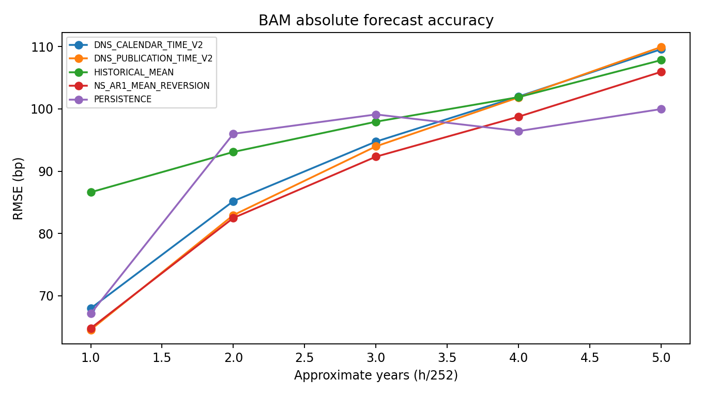

# Sterling — Yield Curve Forecasting

Quantitative finance research on forecasting Moroccan sovereign yield curves with Nelson–Siegel factors, Kalman filtering, regularized time-series models, and XGBoost. Cross-market experiments compare Morocco (Bank Al-Maghrib), euro-area AAA curves (ECB), and U.S. Treasury yields.

The central question is whether these models improve on persistence and simple mean reversion when evaluated without future information.

## Selected findings

The expanded BAM historical evaluation finds one-year RMSE of approximately **64.6 basis points** for publication-time DNS versus **67.1 bp** for persistence. Simple Nelson–Siegel AR(1) performs almost identically at **64.8 bp**. Longer forecasts increasingly represent equilibrium scenarios; persistence is best at the five-year horizon. Overlapping forecast windows limit statistical power, so these are research findings rather than precision pricing claims.



See the [one- to five-year research report](docs/PHASE6_ONE_TO_FIVE_YEAR_YIELD_FORECASTING.md) for evaluation dates, horizon definitions, uncertainty, and limitations.

## Technical work

- Dynamic Nelson–Siegel calibration, Ornstein–Uhlenbeck factor dynamics, and Kalman filtering.
- Expanding-window forecasts with origin-local factor extraction, scaling, and tuning.
- Purged validation, persistence benchmarks, and overlap-aware Diebold–Mariano comparisons.
- Explicit percentage-to-decimal conversion and publication-date controls for macro data.
- Comparisons across NS/PCA ridge models, maturity-specific dynamics, XGBoost, and mean reversion.

## Run locally

Use Python 3.10 or later and install the dependencies in a virtual environment:

```bash
python -m venv .venv
source .venv/bin/activate
python -m pip install -r requirements.txt
```

Run the baseline DNS pipeline using the included aligned CSV, whose BAM and ECB rates are both in percentage points:

```bash
python src/modelling/dns.py \
  --combined-data data/combined/bam_ecb_2004.csv \
  --bam-unit percent --ecb-unit percent \
  --output-dir outputs_dns
```

This uses the aligned BAM/ECB calendar. For a standalone BAM calendar, supply your own `--bam-data` CSV and declare its units explicitly. Internal yields and exported forecasts use decimal rates; figures display percentages.

Run the direct change experiments:

```bash
python -m src.modelling.phase1 \
  --bam-data data/combined/bam_ecb_2004.csv \
  --bam-unit percent --rerun-dns --output-dir outputs_phase1

python -m src.modelling.phase2 \
  --bam-data data/combined/bam_ecb_2004.csv \
  --bam-unit percent --phase1-dir outputs_phase1 \
  --output-dir outputs_phase2
```

These expanding-window experiments can take substantial time. `--rerun-dns` regenerates Phase 1's DNS benchmark rather than relying on a local output cache.

## Repository guide

| Path | Contents |
| --- | --- |
| `src/modelling/` | Models, data loaders, backtests, evaluation, and report generation |
| `docs/` | Research methodology, saved findings, and selected figures |
| `data/` | CSV inputs and source provenance; see [data notes](data/README.md) |
| `requirements.txt` | Runtime dependencies |

Start with the [DNS methodology](dns.md), [initial experiments](docs/PHASE1_RESULTS.md), [nonlinear and maturity-specific comparisons](docs/PHASE2_RESULTS.md), and [cross-market study](docs/PHASE4_CROSS_MARKET_NELSON_SIEGEL.md). The [long-horizon validation](docs/PHASE5C0_LONG_HORIZON_VALIDATION.md) explains why simple mean reversion is an essential benchmark.

Generated `outputs_*` directories, local tests, scratch work, source PDF/spreadsheet archives, environments, and caches are excluded by `.gitignore`. Saved reports retain references to generated tables; regenerate the corresponding experiments to inspect those tables. Existing local files are preserved. See [repository maintenance notes](docs/REPOSITORY_MAINTENANCE.md).
